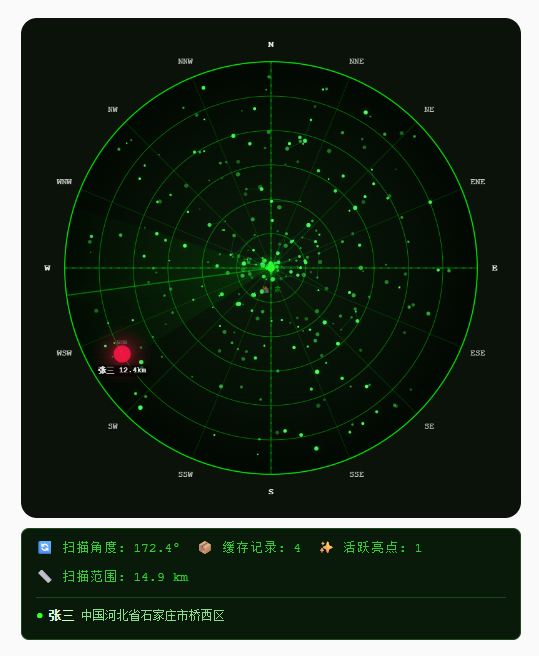

## HA Radar Card

一个用于 Home Assistant 的自定义 Lovelace 卡片，以雷达图的形式直观显示家中人员或设备的位置信息。
支持多目标追踪、动态扫描、高亮显示、自动缩放，并带有详细的状态信息面板。



------

### 特性

- 🎯 在雷达图上显示多个目标（人员/设备）相对于家的位置
- 🔄 持续扫描的雷达波束，自动检测经过波束的目标并高亮
- 📏 自动调整显示范围（最大距离）和缩放比例，确保目标清晰可见
- 🏠 可指定家的位置（通过实体或经纬度）
- 🗺️ 支持背景模式（雷达风格或星空风格，默认为雷达背景）
- 📋 信息面板展示扫描角度、缓存记录、活跃亮点、扫描范围，以及每个活跃目标的名称和详细地址
- 🎨 每个目标可单独配置颜色
- 📦 轻量级，纯前端 Canvas 绘制，无外部依赖

------

### 安装

#### 方法一：通过 HACS

1. 确保你已经安装了 HACS。
2. 在 HACS 中点击“自定义存储库”，添加本卡片的 Git 仓库地址。
3. 搜索并安装 `HA Radar Card`。
4. 刷新浏览器缓存，卡片即会被自动加载。

#### 方法二：手动安装

1. 将 `ha-radar-card.js` 文件下载到 Home Assistant 的 `config/www/ha-my-card` 目录下。

2. 点击左侧边栏的 **“设置”** → 选择 **“仪表盘”** → 点击右上角的 **“三个点”菜单（⋮）** → 选择 **“资源”**。

3. 在资源页面右下角，点击 **“添加资源”**，填入以下信息：

   - **资源 URL**：`/local/ha-my-card/ha-radar-card.js`
   - **资源类型**：在下拉框中选择 **`JavaScript 模块`**（或 `js` 模块）。

   点击 **“保存”** 或 **“创建”**。

4. 保存配置并刷新浏览器。

------

### 基本配置

在 Lovelace 界面中添加卡片时，选择“手动卡片”并粘贴以下配置模板：

```yaml
type: custom:ha-radar-card
home_entity: zone.home
persons:
  - entity: sensor.iphone_geocoded_location   # 基于 Home Assistant App 实体信息
    name: 张三
    color: '#FF1744'
```

------

### 参数说明

| 参数                   | 类型   | 必填   | 默认值    | 描述                                                         |
| :--------------------- | :----- | :----- | :-------- | :----------------------------------------------------------- |
| `home_entity`          | string | 否     | -         | 提供家位置信息的实体（如 `zone.home`）。卡片会读取其 `latitude`/`longitude` 或 `Location` 属性。 |
| `home_lat`             | number | 否     | -         | 当无 `home_entity` 时，直接指定家的纬度（若同时存在则优先使用 `home_entity`）。 |
| `home_lon`             | number | 否     | -         | 当无 `home_entity` 时，直接指定家的经度（若同时存在则优先使用 `home_entity`）。 |
| `persons`              | array  | **是** | -         | 需要追踪的目标列表，每个目标包含以下子参数：                 |
| └ `entity`             | string | **是** | -         | 追踪的实体 ID（如 `sensor.iphone_geocoded_location`），需提供 `latitude`/`longitude` 属性。 |
| └ `name`               | string | 否     | 实体 ID   | 在雷达上显示的名称。                                         |
| └ `color`              | string | 否     | `#FFFFFF` | 目标高亮时的颜色（十六进制，如 `#FF0000`）。                 |
| `background`           | string | 否     | `'solid'` | 背景模式：`'solid'`（雷达背景）或 `'star'`（星空背景）。不设置时默认为 `'solid'`。 |
| `star_rotation_period` | number | 否     | `60`      | 仅当 `background: 'star'` 时有效，星空背景整体旋转一周的秒数（模拟星空缓慢转动）。 |
| `max_distance`         | number | 否     | `15`      | 雷达显示的最大距离（单位：公里），超出此范围的目标将被忽略。 |
| `min_distance`         | number | 否     | `1`       | 自动缩放时的最小显示距离（单位：公里），防止缩放过度。       |

------

### 完整配置示例

```yaml
type: custom:ha-radar-card
home_entity: zone.home
background: star
star_rotation_period: 120
max_distance: 15
min_distance: 1
persons:
  - entity: sensor.iphone1_geocoded_location
    name: 张三
    color: '#FF1744'
  - entity: sensor.iphone2_geocoded_location
    name: 王二
    color: '#4ECDC4'
  - entity: sensor.iphone3_geocoded_location
    name: 李四
    color: '#FFD93D'
```

------

### 工作原理

1. **目标定位**：卡片从每个目标的实体中提取经纬度信息（支持多种属性命名，如 `latitude`/`longitude`、`lat`/`lon`、`Location` 数组，甚至 `state` 为 `"lat,lon"` 的格式）。
2. **距离计算**：以家为中心，计算各目标相对家的平面距离（近似，使用 1° ≈ 111km）。
3. **自动缩放**：根据最远目标的距离自动调整显示范围（`currentMaxDist`）和缩放比例，保证目标始终可见且不过于拥挤。缩放范围受 `min_distance` 和 `max_distance` 约束。
4. **扫描与高亮**：雷达波束持续旋转（周期约 4 秒），每当波束扫过某个目标（角度容差约 3°），该目标即被“高亮”（光晕+标签），高亮持续约 4 秒后逐渐淡出。
5. **信息面板**：显示当前的扫描角度、缓存的历史记录数、当前活跃亮点数量、扫描范围（最大显示距离），并列出每个活跃目标的名称和详细地址（从实体属性中拼接，如 `Country`、`City`、`Street` 等，若无法获取则显示经纬度）。

------

### 注意事项

- 确保你的实体（无论是人员、设备还是区域）正确报告了经纬度信息。
- 家位置可以来自一个实体（例如 `zone.home`）或直接指定坐标。若通过实体，请确保该实体具有 `latitude` 和 `longitude` 属性。
- 卡片默认使用 `Courier New` 等宽字体，若需更换请自行修改 JavaScript 中的字体设置。
- 距离显示为“公里”（km），计算基于经纬度差值乘以 111，实际地球曲率未做修正，适合小范围（<100km）使用。
- 高亮目标的生命周期为 4 秒，若波束多次扫过同一目标，其高亮时间会刷新。
- 信息面板中的“地址”会尝试从实体属性中按顺序拼接以下字段：`Country`、`Administrative Area`、`Locality`、`Sub Locality`、`Thoroughfare`、`Street`、`Address`、`City`、`State`、`Region`，若均无有效值则显示经纬度。

------

### 故障排查

- **卡片不显示**：检查资源是否加载成功（浏览器开发者工具查看网络请求），并确认 Lovelace 配置中 `type` 正确。
- **目标不出现**：确认实体的经纬度属性是否可读，检查家位置是否设置正确（若 `home_entity` 无效，可改用 `home_lat`/`home_lon`）。
- **目标距离显示异常**：检查经纬度单位是否为十进制度数，避免使用度分秒格式。
- **扫描角度不更新**：确认浏览器未卡顿，卡片在 `disconnectedCallback` 中会清理动画循环，若切换视图后可能需刷新页面。

------

### 开发者与贡献

- 卡片采用原生 Web Component 编写，无外部依赖。
- 你可以在 Home Assistant 社区论坛中反馈问题或提出改进建议。
- 欢迎提交 Pull Request 增强功能。

------

### 许可

本项目采用 MIT 许可证，详情请见 LICENSE 文件。

------

**享受你的雷达吧！** 🚀
